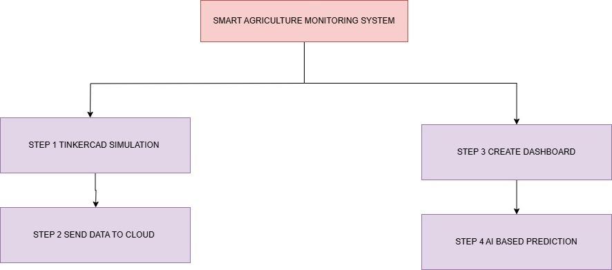

# IoT-Based Farm Monitoring Simulation with AI Prediction

## Project Overview:

This project simulates an IoT-based farm monitoring system using:

- **TinkerCAD** (for virtual sensor simulation)
- **Node-RED** (for data flow & dashboard)
- **Firebase** (for real-time cloud storage)
- **Google Colab & Machine Learning** (for AI-based crop health prediction)

---

## Technologies Used:

### Hardware (Simulated in TinkerCAD)
- **Soil Moisture Sensor** (Potentiometer)
- **Temperature & Humidity Sensor** (DHT11)
- **Light Sensor** (LDR)
- **Water Level Sensor** (Variable Resistor)
- **Arduino/ESP32**

### IoT Communication
- **Node-RED** (MQTT/HTTP)
- **Firebase** (Real-time database)

### AI/ML for Prediction
- **Google Colab & Python**

---

## Features of the System:

### Real-Time Monitoring:
- Sensors collect real-time data for **soil moisture**, **temperature & humidity**, **light levels**, and **water levels**.

### Cloud Integration:
- Data from the sensors are sent to **Firebase**, providing cloud storage for easy access and analysis.
  
### AI-Based Predictions:
- **Google Colab** and **Machine Learning** algorithms analyze historical data to make predictions about **crop health**, identifying potential problems (e.g., watering needs, pest detection, etc.).

### Data Flow and Dashboard:
- **Node-RED** integrates the data flow and provides an intuitive dashboard for visualizing the real-time sensor data and AI predictions.

---

## How It Works:

1. **Sensor Data Collection**: The sensors (moisture, temperature, humidity, light, water level) collect data from the farm environment.
2. **Data Transmission**: The data is transmitted to the cloud (Firebase) through **Node-RED** using MQTT or HTTP protocols.
3. **AI Prediction**: Using **Google Colab** and machine learning models, predictions about crop health and optimal farming actions (e.g., when to water, pest control) are made.
4. **Real-Time Visualization**: The dashboard created in **Node-RED** allows users to monitor the farm's real-time conditions and predictions.

---

## Benefits of the System:
- **Automated Farm Management**: Minimizes human intervention by predicting
- **Resource Optimization**: Helps in conserving water and resources by accurately predicting the needs of the crops.
- **Data-Driven Insights**: Machine learning provides insights for better crop management and yield predictions.
  
---

## Future Enhancements:

1. **Integration of More Sensors**:
   - Incorporate additional sensors such as **pH Sensors**, **Nutrient Sensors**, and **Rainfall Sensors** to enhance data collection and provide more comprehensive insights for crop management.

2. **Automated Irrigation System**:
   - Implement an automated irrigation system that uses real-time sensor data to activate sprinklers or irrigation pumps when soil moisture levels are low, based on AI predictions and weather data integration.

3. **Edge Computing with AI**:
   - Shift AI prediction models from the cloud to edge devices like **ESP32** or **Raspberry Pi** to reduce latency and make real-time predictions more efficient at the farm level.

4. **Drone Integration for Crop Monitoring**:
   - Integrate **drones** with cameras and sensors that collect visual and environmental data from the farm to improve monitoring of large farm areas. These drones can be used to identify crop health issues, pest infestations, and growth anomalies.

5. **Weather Prediction Integration**:
   - Add **weather forecasting integration** to the system to predict upcoming weather conditions, which could affect the farm. This will help in making better predictions related to irrigation needs and protecting crops from harsh weather conditions.

6. **Blockchain for Data Integrity**:
   - Use **blockchain technology** to ensure the integrity and security of the collected data, allowing farmers to trace the data history for better decision-making and transparent farm management.

7. **Mobile App for Real-Time Alerts**:
   - Develop a mobile app that sends **real-time notifications** and alerts to farmers about critical conditions like low soil moisture, high temperatures, or pest detection, allowing them to take immediate action.

8. **AI-based Pest Detection and Control**:
   - Enhance the AI system to detect **pests and diseases** in crops by analyzing sensor data, historical patterns, and possibly images from cameras or drones, allowing the system to recommend pest control measures.

9. **Integration with Smart Equipment**:
   - Allow the system to connect with other **smart farming equipment**, such as autonomous tractors or harvesting machines, to optimize farming processes through automation and precision.

10. **Advanced Data Analytics and Visualization**:
    - Improve the dashboard in **Node-RED** to provide more advanced data analytics and visualizations, such as crop yield predictions, comparative analyses, and soil health tracking over time, aiding farmers in making more data-driven decisions.

---

